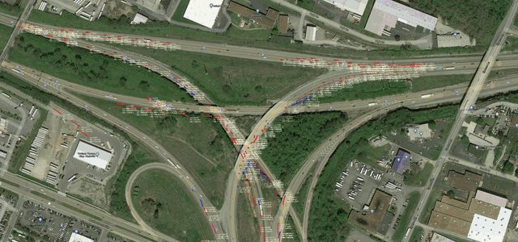
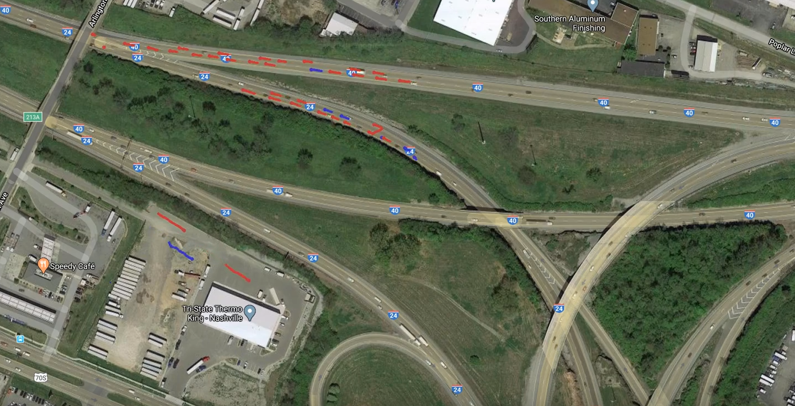
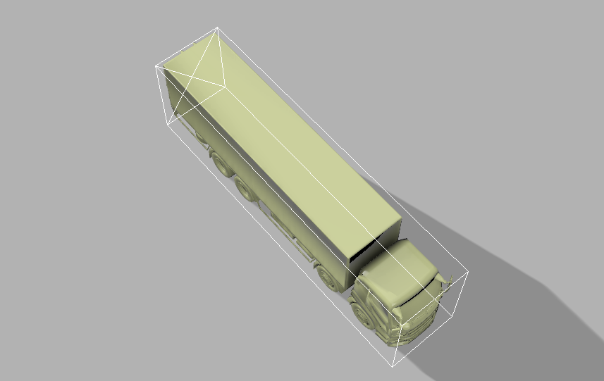

# I-24 MOTION examples

The I-24 Mobility Technology Interstate Observation Network (MOTION) is a planned open-road testbed that will enable continuous,ongoing coverage of a roadway at the fine-grained vehicle trajectory level. MOTION consists of a network of 400 pole-mounted 4k resolution cameras recording video data that covers a six mile stretch of freeway in its entirety. The raw video data stream ex-ceeds 130 TB/day of traffic data footage that must be processed in real-time to extract precise vehicle locations, trajectories, and other relevant information from the entire monitored portion ofroadway. Data is reported for each of the 180,000 vehicles per day that travel on the roadway throughout the full length of the instrumented freeway. The first phase of MOTION is scheduled for completed construction by the end of 2020 and will consist of a 3-pole, 18 camera deployment covering roughly 1800 feet of roadway. Phase II will consist of the full 6-mile streth of roadway and is scheduled for completion by the end of 2022.

## Test Examples
  

Data in this repository was generated from a 6-camera, single pole test deployment from August 9-16, 2019. One-minute examples of video from each camera can be found at the following link. Privacy considerations prevent more of the data from being posted at this time.
- [Camera 0 Example](https://youtu.be/IswkVF8NMfw)
- [Camera 1 Example](https://youtu.be/8itD0df2QtQ)
- [Camera 2 Example](https://youtu.be/-f-4LNn61PM)
- [Camera 3 Example](https://youtu.be/PXJgy5UNZkw)
- [Camera 4 Example](https://youtu.be/3E0QxdA9B-w)
- [Combined Trajectories](https://youtu.be/HFetLV5S5zA)

## About this Repository
This repository serves as an example of the algorithms that will convert raw video data into global vehicle trajectories. Included are:
- **example_data** - examples of JSON output format of trajectory data 
- **point_matching** - examples of the data used to match camera images to corresponding GPS coordinates and satellite imagery
- **pipeline.py** - an example that can be run on any video to produce detections and tracks, and (if matching coordinates are input) GPS trajectories
- **assorted utility files** containing the functions used by pipeline.py

## Object detection 
At present, this repository uses a [pytorch implementation of YOLO v3](https://github.com/ayooshkathuria/pytorch-yolo-v3) for detection of vehicles in each frame. Detection accuracy is fairly high but is still susceptible to occasional missed objects and false detections. Experiments have also been run using the [torchvision implementation of Faster-RCNN for detection](https://pytorch.org/docs/stable/_modules/torchvision/models/detection/faster_rcnn.html). These algorithms run at about 1-2 fps at present on 4k imagery, far short of the realtime goal of 30 fps. Future work will explore alternative network architectures and strategies for speeding up detection based on the tracking context. 

## Object Tracking
The tracking strategy proposed in [Simple Online and Realtime Tracking](https://ieeexplore.ieee.org/abstract/document/7533003) is implemented. This strategy uses Kalman filtering for estimating the future positions of tracked objects so that they can be matched to detected objects in future frames. Additionally, this strategy allows the position of objects to be estimated even when they are not detected in some frames. 

## Trajectory Conversion
At present, trajectories are converted from image space to GPS coordinates via homography. Given a set of points from the image and their corresponding GPS coordinates, the projective transform mapping the image points into GPS points is determined and used to transform subsequent object locations into GPS coordinate locations. The projection error is fairly low in areas close to the points used to define the transform (the upper roadways in this image), but are much worse farther from the points used to define the tranform (the lower roadways and offset trajectories in this image). In the future, more points will be used to map between image space and GPS coordinates via bilinear interpolation. 

## Other Future Work 
### 3D object detection 
Estimating vehicle locations as 2D bounding boxes causes errors when these locations are projected into GPS coordinates because it is difficult to estimate the footprint of a vehicle based on its 2D bounding box. In the future, a 3D object detector will be used, which much more precisely localizes vehicle footprints and will minimize projection error. Unfortunately, training 3D object detectors for this task is a challenge because most existing datasets of 3D vehicles are focused on self-driving contexts, where vehicles are nearby and perspective plays a large role in vehicle appearances. To combat this, we are currently working on 3D model-based methods for creating labeled image data on which to train 3D object detectors.

### Filtering Refinements
Currently, we make no refinements to the Kalman Filtering method. In the future, we will take into account the context of vehicle motion to intelligently eliminate false positives and to constrain vehicle trajectories within reasonable physical limits. Additionally, we will implement a deep feature encoding for object reidentification as in [Deep SORT](https://arxiv.org/abs/1703.07402) to help match tracks across cameras and after occlusions. 

### GPS-based Trajectory Projection
Manually matching points in an image to GPS coordinate counterparts is time-consuming and potentially innaccurate. In the future, we will use tracked traectories of vehicles instrumented with GPS-logging devices to establish accurate transforms between image space and GPS coordinates.

## How to Run
To run the pipeline yourself,clone the repository and install the required packages indicated in requirements.txt. Note that this code was implemented for running on a GPU (but with slight modification could run on a CPU). Then, run pipeline.py with the following inputs:

- path to video file
- (optional) - path to saved numpy file containing camera image matching points (4x2) array with 4 x,y coordinate pairs
- (optional) - path to saved numpy file containing satellite image matching points (4x2) array with 4 x,y coordinate pairs
- (optional) - path to saved numpy file containing GPS coordinate matching points (4x2) array with 4 x,y coordinate pairs
- (optional) - satellite image of the area in which vehicles are tracked
