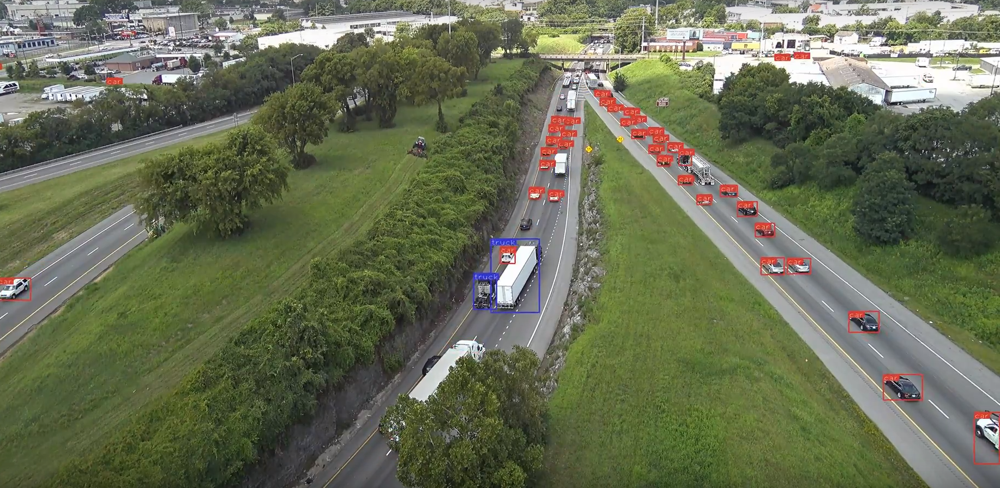

# I-24 MOTION examples

The I-24 Mobility Technology Interstate Observation Network (MOTION) is a planned open-road testbed that will enable continuous,ongoing coverage of a roadway at the fine-grained vehicle trajectory level. MOTION consists of a network of 400 pole-mounted 4k resolution cameras recording video data that covers a six mile stretch of freeway in its entirety. The raw video data stream ex-ceeds 130 TB/day of traffic data footage that must be processed in real-time to extract precise vehicle locations, trajectories, and other relevant information from the entire monitored portion ofroadway. Data is reported for each of the 180,000 vehicles per day that travel on the roadway throughout the full length of the instrumented freeway. The first phase of MOTION is scheduled for completed construction by the end of 2020 and will consist of a 3-pole, 18 camera deployment covering roughly 1800 feet of roadway. Phase II will consist of the full 6-mile streth of roadway and is scheduled for completion by the end of 2022.

##### TODO - Insert best GIF here

This repository serves as an example of the algorithms that will convert raw video data into global vehicle trajectories. Included are:

- example_trajectories.json - an example of the output trajectories from the processing pipeline
- pipeline.py - 
- example video, coordinates, and world image
- and assorted utility files containing the functions used by pipeline.py:

## How to Run
To run the pipeline yourself, download clone the repository and install the required packages indicated in requirements.txt. Note that this code was implemented for running on a GPU but can also be run on a CPU at a much slower rate. Then, run pipeline.py with the following inputs:

- path to video file
- (optional) - path to a csv containing transform matching points
- (optional) - map imagery or overhead view of the area in which vehicles are tracked.

## Object detection 
At present, this repository uses a [pytorch implementation of YOLO v3](https://github.com/ayooshkathuria/pytorch-yolo-v3) for detection of vehicles in each frame. Detection accuracy is fairly high but is still susceptible to occasional missed objects and false detections. Experiments have also been run using the [torchvision implementation of Faster-RCNN for detection](https://pytorch.org/docs/stable/_modules/torchvision/models/detection/faster_rcnn.html). These algorithms run at about 1-2 fps at present on 4k imagery, far short of the realtime goal of 30 fps. Future work will explore alternative network architectures and strategies for speeding up detection based on the tracking-context. 

## Object Tracking
The tracking strategy proposed in [Simple Online and Realtime Tracking](https://ieeexplore.ieee.org/abstract/document/7533003) is implemented. This strategy uses Kalman filtering for estimating the future positions of tracked objects so that they can be matched to detected objects in future frames. Additionally, this strategy allows the position of objects to be estimated even when they are not detected in some frames. 

## Trajectory Conversion
Picture and gif of tracks

## Trajectory extraction - show math and examples

## Future Work -
extending RCNN with FastTrack
3D object detection - 
Refinements to tracks in 3D space
Refinements to filter method (deal with false positives)
Multiple plane projection (bilinear interpolation)
Eventually using GPS tracks to synch
